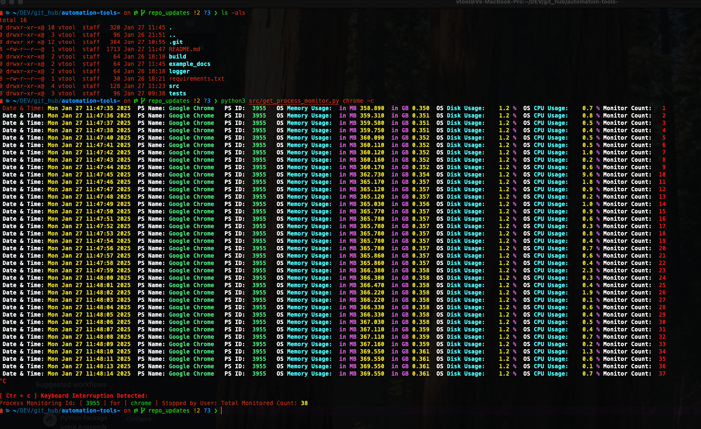
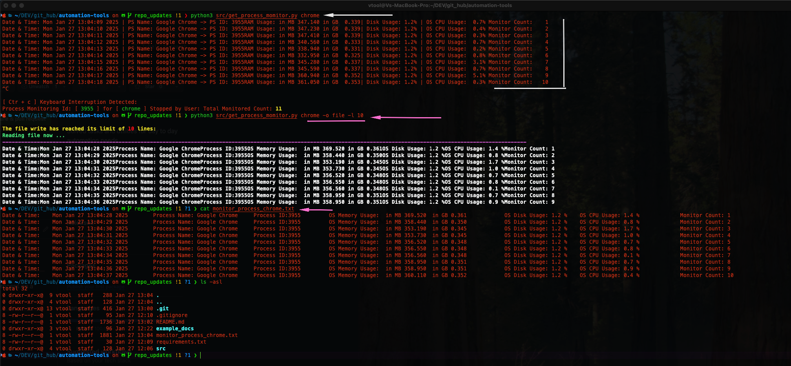
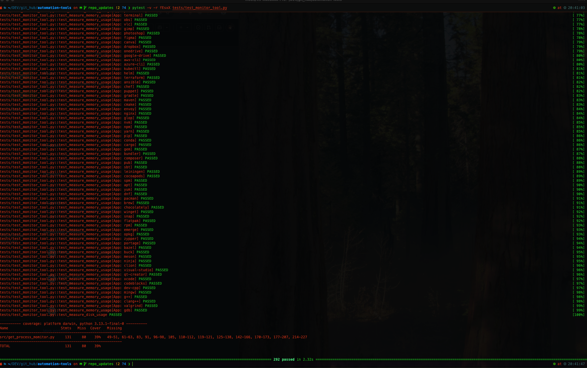
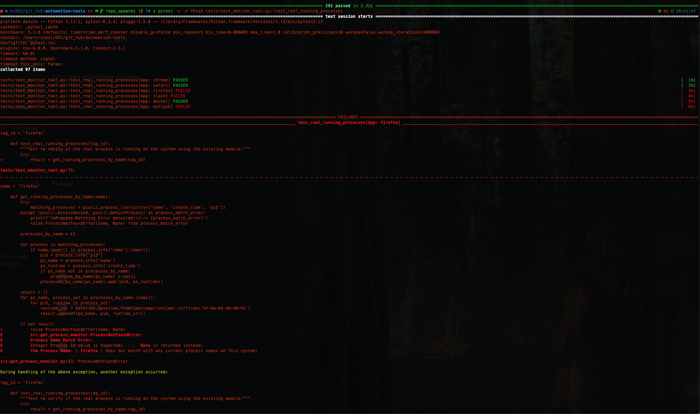
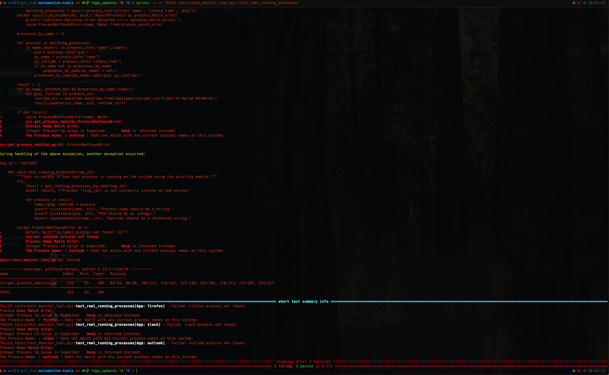

## License
This project is licensed under the [MIT License](LICENSE). You are free to use, modify, and distribute this software under the terms of the license.

# **Process Monitoring Tool**

This Python script is designed to measure the **CPU usage**, **memory usage**, and **disk usage** of a running process on your system. It outputs the results either to the terminal or a file, providing flexible and clear monitoring for system processes.

---

## **Features**
- Monitor **CPU**, **Memory**, and **Disk** usage of any running process.
- Output results to:
  - **Terminal** (with optional colored output).
  - **File** (with an option to limit the number of lines written).
- User-friendly CLI with flexible options.

---

## **Dependencies**
The script requires the following Python libraries:
- `psutil`
- `datetime` (standard library)
- `argparse` (standard library)
- `colorama`

### Install Dependencies
You can install the required libraries using `pip`:

```bash
pip install -r requirements.txt
```
>- usage: get_monitor_process.py [-h] process_name [-o {terminal,file}] [-l LINE_LIMIT] [-c]<br>
>- Measure CPU, Memory, and Disk usage for a given process.<br>
>- positional arguments:
>- process_name          Name of the process to monitor.
>- optional arguments:
>-  -h, --help            Show this help message and exit.
>-  -o, --output          Specify output type: `terminal` (default) or `file`.
>-  -l, --line-limit      Limit the number of lines written to the output file.
>-  -c, --colored_output  Enable colored output for terminal display.

```bash
  python3 get_monitor_process.py python
  python3 get_monitor_process.py nginx -o file
  python3 get_monitor_process.py apache2 -c
  python3 get_monitor_process.py chrome -o file -l 100
```

## Usage Screenshots & Examples:

***


***

# PyTest Configuration and Usage

This project leverages `pytest` for testing and includes mock and real test examples. Below are the details on running the tests, examples of commands, and visual outputs.

---

## Table of Contents
- [PyTest Configuration](#pytest.ini)
- [Apps Config used in PyTest](configs/process_names.yml)
- [Markers and Test Selection](#markers-and-test-selection)
- [PyTests Screenshots & Examples](#pytest-screenshots--examples)

---
#### The configuration for pytest is located in the [pytest.ini](pytest.ini) file:

>- How to Run Tests CLI Examples:
``` bash
pytest -vv
pytest -m "slow"
pytest -m "not slow"
pytest -m "slow or integration"
pytest --cov=src --cov-report=term-missing

pytest -v -r charts tests/test_monitor_tool.py
pytest -v -r fEsxX tests/test_monitor_tool.py
  
pytest -v -r charts -m "not slow" tests/test_monitor_tool.py
pytest -v -r fEsxX tests/test_monitor_tool.py::test_real_running_processes
  
pytest -v -r charts tests/test_monitor_tool.py::test_get_running_processes_by_name
pytest -v -r charts tests/test_monitor_tool.py::test_measure_cpu_usage
pytest -v -r charts tests/test_monitor_tool.py::test_measure_memory_usage
pytest -v -r charts tests/test_monitor_tool.py::test_measure_disk_usage

```
---
## PyTests Screenshots & Examples:
>PyTests Mock Examples:

***
>Real PyTests Examples:

>Real PyTests Examples:
